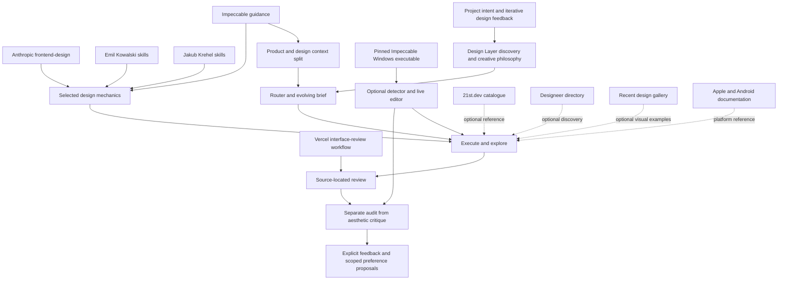

# Design Layer lineage

This map explains where the present capabilities came from. An influence is not a runtime dependency, and a source credit is not evidence that its full workflow was adopted.

## Inherited mechanics

| Source | What carries forward | What does not follow from that influence |
| --- | --- | --- |
| Anthropic frontend-design | Ground a visual direction in its subject; make coherent, deliberate choices | A required Claude runtime, a copied aesthetic or a guarantee of originality |
| Emil Kowalski skills | Give motion a purpose; account for interruption, repeated use and reduced motion | Mandatory durations, a required animation library or motion on every interaction |
| Jakub Krehel skills | Fine interface craft and attention to states, type, layout and accessibility | A universal visual recipe |
| Vercel interface review | Locate findings in concrete source evidence | A Vercel deployment requirement or bundled Vercel code |
| Impeccable | Product/design context separation, useful transformation lenses, detector/live protocols | Automatic acceptance of its stylistic opinions or installation of its skill pack and hooks |

The first source revisions are pinned in [sources.lock.json](../sources.lock.json). The later executable is a separately pinned registry artifact. The project preserves that distinction rather than claiming the guidance and binary came from one build.

Earlier private skill variants were used as comparison material during development. They were consolidations with overlapping ancestry, not additional independent validation. Selected mechanics were rewritten into contextual references. The private archives, personal profiles and their contents are not distributed, and their complete upstream ancestry has not been established.

## Design Layer's own workflow

The following is the project's orchestration and collaboration design, developed through iteration rather than imported as one upstream skill:

- Route through a small relevant skill instead of loading the entire design library.
- Establish project intent through divergent discovery and refined questions before presenting a visual interpretation.
- Keep the interpretation provisional, including when the user likes its overall feeling.
- Carry confirmed intent, reasons and corrections in an evolving brief.
- Distinguish confirmed functional defects, detector candidates and aesthetic judgments.
- Keep explicit feedback scoped to its context, with append-only corrections and reviewable broader proposals.
- Preserve intentional expressive details when simplifying generated work.

These choices aim to reduce premature convergence, generic styling and accumulated misunderstandings. They are design intentions, not experimentally established superiority claims. The three-round interview and question range are collaboration defaults, not a universal optimum.

## Added repertoire and adapters

Fine craft, transformation and native-platform references expand what the agent can consider when the brief calls for it. They do not apply every technique to every project. The 21st.dev reference supplies category names and links for discovery; no component implementation is bundled or mandated.

[Designeer](https://www.designeer.xyz/) adds an optional route to inspiration, tools, learning material and practitioners. Its public catalogue and browser WebMCP queries were inspected on 2026-10-03. The integration provides task-to-category guidance and a browser fallback; it does not copy the catalogue, bundle its tools or independently endorse listed resources. Chosen examples and implementation claims are checked at their original sources.

[Recent](https://recent.design/) adds optional curated visual examples, creator and source links, and specialist galleries. Its public feed, example metadata, website filtering and app-icon gallery were inspected on 2026-10-03. No media or third-party skill is bundled through this entry.

The 0.4.0 craft expansion separately pins Emil's apple-design, prototype and animation-vocabulary skills, Jakub's OKLCH skill, and selected User Interface Wiki references. It adds conditional colour-system and gesture references, full-size interactive comparison guidance, motion terminology, and focused lifecycle, measurement, sound, prefetch and icon/type principles. It preserves source licences and earlier revision pins. Fixed aesthetics, mandatory libraries, glossary response restrictions and universal animation prescriptions were not adopted. The WCAG large-text units in the OKLCH source were corrected against W3C rather than inherited.

The expressive interaction reference is Design Layer-authored decision guidance connecting material and spatial intent to rendering techniques. It links MDN and Three.js documentation for technical implementation; it bundles no graphics library, example code or third-party visual identity.

The optional Impeccable adapter translates tool output into Design Layer's review categories. The underlying executable remains unmodified. A separate local live-edit workflow checks source spans, preserves recoverable snapshots and documents the boundaries of the Windows pilot.

## Publication boundary

The public package includes reusable guidance, scripts, synthetic fixtures, pinned tool provenance and upstream notices. It excludes personal profiles, configured profile paths, private project records, observation logs and development history. Optional preference support remains available to each installer through external configuration.

For operating relationships rather than source history, see [architecture](architecture.md). For copyright and licence texts, see [NOTICE](../NOTICE.md).
